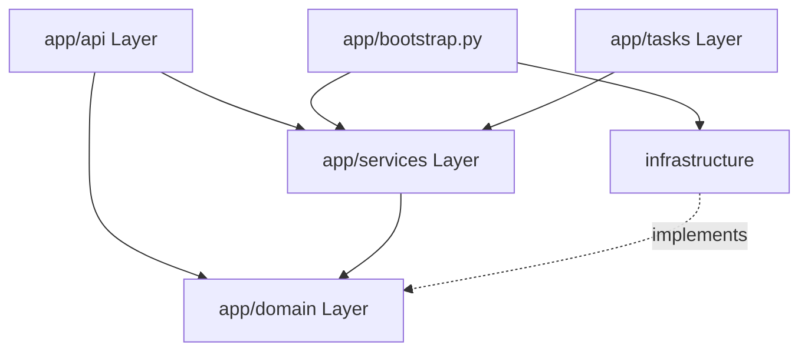

# Implementation Plan: Refactor vk-service to Layered Architecture

Branch: refactor/vk-service-layered-architecture
Created: 2026-06-18

## Settings
- Testing: yes
- Logging: verbose
- Docs: yes

## Roadmap Linkage
Milestone: "Рефакторинг микросервисов (vk-service к слоистой архитектуре)"
Rationale: "Migrates the FastAPI-based vk-service to a layered architecture, improving maintainability, testability, and decoupling core domain rules from database and external integrations."

## Commit Plan
- **Commit 1** → Task 1.1: Decompose SQL models by bounded context
- **Commit 2** → Task 1.3: Set up base imports & Task 1.4: Update Alembic env.py configuration
- **Commit 3** → Task 1.2: Define abstract repository interfaces
- **Commit 4** → Task 2.1: Implement concrete repositories & Task 2.2: Relocate third-party clients
- **Commit 5** → Task 2.3: Implement integration tests for repositories
- **Commit 6** → Task 3.1: Relocate and adapt use case logic to Services
- **Commit 7** → Task 4.1: Create Composition Root (`bootstrap.py`), Dependencies and Task 4.2: Present Routers & Schemas
- **Commit 8** → Task 5.1: Structure background tasks and workers
- **Commit 9** → Task 6.1: Update main app entrypoint & Task 6.2: Adapt test suites
- **Commit 10** → Task 6.3: Verification & Cleanup (comment out imports → verify tests → separate delete commit), Task 6.4: Update docs & Task 6.5: Update CI/CD configurations

---

## Architecture Mapping (Was → Became)

To satisfy logical decomposition, we group models by bounded context, avoiding arbitrary line count splits:

| File / Folder (Was) | Target Path (Became) | Layer | Responsibility / Notes |
|:---|:---|:---|:---|
| `app/db/models.py` | `app/domain/models/vk_ingestion.py` | Domain | `VkGroup`, `VkAuthor`, `VkPost`, `VkComment` models |
| `app/db/models.py` | `app/domain/models/vk_friends.py` | Domain | `VkFriendsExportJob`, `VkFriendsJobLog`, `VkFriendsRecord` models |
| `app/db/models.py` | `app/domain/models/ok_friends.py` | Domain | `OkFriendsExportJob`, `OkFriendsJobLog`, `OkFriendsRecord` models |
| `app/db/models.py` | `app/domain/models/tasks.py` | Domain | `VkTaskRun`, `ProcessedEvent` models |
| `app/db/models.py` | `app/domain/models/outbox.py` | Domain | `OutboxEvent` model |
| *New* | `app/domain/repositories/` | Domain | Abstract interfaces (`vk_friends.py`, `ok_friends.py`, `ingestion.py`, `outbox.py`, `tasks.py`) |
| `app/modules/vk_friends/service.py`, `crud_service.py`, `export_service.py` | `app/services/vk_friends_service.py` | Services | Use case orchestrator for VK friends export |
| `app/modules/ok_friends/service.py`, `crud_service.py`, `export_service.py` | `app/services/ok_friends_service.py` | Services | Use case orchestrator for OK friends export |
| `app/modules/ingestion/service.py`, `collector.py` | `app/services/ingestion_service.py` | Services | Wall and comments parser logic |
| `app/modules/vk_api/client.py`, `api_methods.py` | `app/infrastructure/vk_client/` | Infrastructure | VK API communication client wrapper |
| `app/modules/ok_api/client.py` | `app/infrastructure/ok_client/` | Infrastructure | OK API communication client wrapper |
| `app/modules/vk_friends/router.py` | `app/api/routers/vk_friends.py` | API | HTTP Endpoints for VK friends export |
| `app/modules/ok_friends/router.py` | `app/api/routers/ok_friends.py` | API | HTTP Endpoints for OK friends export |
| `app/modules/vk_api/router.py` | `app/api/routers/vk_api.py` | API | HTTP Endpoints for low-level VK operations |
| `app/modules/outbox/publisher.py` | `app/tasks/outbox_worker.py` | Tasks / Infra | Outbox transactional background publisher |
| `app/modules/tasks/consumer.py` | `app/tasks/kafka_consumer.py` | Tasks / Infra | Kafka event consumer daemon loop |
| `app/clients/tasks/client.py` | `app/infrastructure/tasks_client/` | Infrastructure | Internal HTTP client for tasks-service |
| `app/db/session.py` | `app/infrastructure/db/session.py` | Infrastructure | Database connection pool and async session factory |
| *New* | `app/bootstrap.py` | Composition Root | Instantiates concrete repositories and wires services |

---

## Target Layer Dependency Diagram


---

## Code Examples

### 1. Abstract Domain Repository Interface (`app/domain/repositories/vk_friends.py`)
```python
import uuid
from abc import ABC, abstractmethod
from typing import Any, Sequence
from app.domain.models.vk_friends import VkFriendsExportJob, VkFriendsJobLog

class VkFriendsRepository(ABC):
    @abstractmethod
    async def create_job(self, params: dict, vk_user_id: int | None = None) -> VkFriendsExportJob:
        """Create a new VK friends export job record and add starting log."""

    @abstractmethod
    async def get_job_by_id(self, job_id: uuid.UUID) -> VkFriendsExportJob | None:
        """Retrieve job record by UUID."""

    @abstractmethod
    async def get_job_logs(self, job_id: uuid.UUID, limit: int = 200) -> Sequence[VkFriendsJobLog]:
        """Fetch job logs ordered by creation timestamp."""

    @abstractmethod
    async def update_progress(self, job_id: uuid.UUID, fetched_count: int, total_count: int | None = None, warning: str | None = None) -> None:
        """Atomically update progress fields of a job."""

    @abstractmethod
    async def complete_job(self, job_id: uuid.UUID, fetched_count: int, total_count: int | None, warning: str | None, xlsx_path: str) -> None:
        """Transition job status to DONE and save final output path."""

    @abstractmethod
    async def fail_job(self, job_id: uuid.UUID, error: str, fetched_count: int, total_count: int | None = None, warning: str | None = None) -> None:
        """Transition job status to FAILED and store exception message."""

    @abstractmethod
    async def save_friends_batch(self, job_id: uuid.UUID, records: list[dict]) -> None:
        """Save a batch of friend profiles records to database."""
```

### 2. Composition Root (`app/bootstrap.py`)
To prevent the Presentation Layer (`app/api`) from importing concrete Infrastructure packages directly (which violates the dependency rule), dependencies are wired in a Composition Root:
```python
from sqlalchemy.ext.asyncio import AsyncSession
from app.infrastructure.db.repositories.vk_friends import SqlAlchemyVkFriendsRepository
from app.infrastructure.vk_client.client import VkApiClient
from app.services.vk_friends_service import VkFriendsExportService

def get_vk_friends_service(session: AsyncSession) -> VkFriendsExportService:
    repo = SqlAlchemyVkFriendsRepository(session)
    # Note: VkApiClient is stateless (vk_api library uses synchronous connections). 
    # For async HTTP clients (like OK API wrappers using httpx.AsyncClient),
    # implement a singleton pattern or utilize FastAPI lifespan events to manage connection lifecycles.
    vk_client = VkApiClient()
    return VkFriendsExportService(repo=repo, vk_client=vk_client)
```

### 3. API Dependency Hook (`app/api/dependencies.py`)
```python
from fastapi import Depends
from sqlalchemy.ext.asyncio import AsyncSession
from app.db.session import get_session
from app.bootstrap import get_vk_friends_service
from app.services.vk_friends_service import VkFriendsExportService

async def get_vk_friends_service_dep(
    session: AsyncSession = Depends(get_session)
) -> VkFriendsExportService:
    return get_vk_friends_service(session)
```

### 4. API Router (`app/api/routers/vk_friends.py`)
```python
import uuid
from fastapi import APIRouter, Depends, BackgroundTasks, status
from app.api.dependencies import get_vk_friends_service_dep
from app.services.vk_friends_service import VkFriendsExportService
from app.api.schemas.vk_friends import (
    VkFriendsExportStartRequest,
    VkFriendsExportStartResponse,
)

router = APIRouter(prefix="/internal/vk/friends", tags=["vk-friends"])

async def run_export_job_background(job_id: uuid.UUID, params: dict):
    # Background execution needs its own database session context to avoid 
    # connection closures during request termination.
    from app.db.session import SessionLocal
    from app.bootstrap import get_vk_friends_service
    async with SessionLocal() as session:
        service = get_vk_friends_service(session)
        await service.run_export_job(job_id, params)

@router.post("/export", response_model=VkFriendsExportStartResponse, status_code=status.HTTP_201_CREATED)
async def start_export(
    payload: VkFriendsExportStartRequest,
    background_tasks: BackgroundTasks,
    service: VkFriendsExportService = Depends(get_vk_friends_service_dep),
) -> VkFriendsExportStartResponse:
    params = payload.params
    vk_user_id = params.get("user_id")

    job = await service.create_job(params, vk_user_id=vk_user_id)
    background_tasks.add_task(run_export_job_background, job.id, params)

    return VkFriendsExportStartResponse(job_id=str(job.id), status=job.status)
```

---

## Configuration & Core
- `app/core/config.py` remains unchanged.
- New layers will read configuration options from `app.core.config.settings` directly.
- No changes to environment variables or compose profiles.

---

## Test Organization
To maintain architectural separation, tests will be organized as follows:
```
tests/
├── unit/                         # Unit tests with mocks
│   ├── services/                 # Test services with mocked repositories
│   └── infrastructure/           # Test HTTP clients and helpers with mock requests
├── integration/                  # Integration tests with real resources
│   ├── repositories/             # Test concrete repositories using test PostgreSQL database
│   └── api/                      # Test FastAPI endpoints using TestClient
└── e2e/                          # End-to-end integration flows (external dependencies mock)
```

### Test Execution
- Unit only: `pytest -m unit`
- Integration only: `pytest -m integration`
- All: `pytest`

Configure `pytest.ini` markers for clean test separation:
```ini
[pytest]
markers =
    unit: Unit tests with mocks
    integration: Integration tests with real resources
```

---

## Rollback Strategy
- After each commit, run locally: `uv run pytest` and verify endpoints via `curl http://localhost:8000/health`.
- If tests or health checks fail, use `git revert HEAD` to return to the last functional commit (do not use destructive `git reset --hard` commands).
- Keep the `refactor/vk-service-layered-architecture` branch for at least 1 week after merging into main.

---

## Tasks

### Phase 0: Test Safety Net & Preparation
- [x] **Task 0.1: Run baseline test suite**
  - **Subject:** Execute existing tests before refactoring
  - **Description:** Run all tests within `services/vk-service/tests` and check execution status to guarantee that refactoring starts from a green state.
  - **Logging:** Standard pytest stdout dump.
  - **Files:** `services/vk-service/tests/`

- [x] **Task 0.2: Create backup branch**
  - **Subject:** Create pre-refactor backup git branch
  - **Description:** Run `git branch backup/pre-refactor-$(date +%Y%m%d)` to create a snapshot branch. This acts as a fallback checkpoint for catastrophic failures.
  - **Logging:** Git branch command output.
  - **Files:** None (Git metadata changes only).

### Phase 1: Domain Models Split (Decomposition)
- [x] **Task 1.1: Decompose SQL models into domain model files**
  - **Subject:** Group domain models by bounded context
  - **Description:** Decompose SQL models into separate files under `app/domain/models/` ensuring `__tablename__`, index definitions, constraints, and foreign keys are preserved exactly as defined in `app/db/models.py`.
    - Write ingestion models (`VkGroup`, `VkAuthor`, `VkPost`, `VkComment`) to `app/domain/models/vk_ingestion.py`.
    - Write friends models to `app/domain/models/vk_friends.py` and `app/domain/models/ok_friends.py`.
    - Write task run and events to `app/domain/models/tasks.py`.
    - Write outbox models to `app/domain/models/outbox.py`.
  - **Logging:** Confirm modules compile clean.
  - **Files:**
    - `services/vk-service/app/domain/models/vk_ingestion.py`
    - `services/vk-service/app/domain/models/vk_friends.py`
    - `services/vk-service/app/domain/models/ok_friends.py`
    - `services/vk-service/app/domain/models/tasks.py`
    - `services/vk-service/app/domain/models/outbox.py`

- [ ] **Task 1.2: Define abstract repository interfaces in Domain**
  - **Subject:** Establish abstract database boundaries
  - **Description:** Create interface files under `app/domain/repositories/` outlining standard database access methods for VkFriends, OkFriends, Ingestion, Tasks, and Outbox. Ensure zero dependency on SQLAlchemy constructs inside interfaces.
  - **Logging:** Clean Python type-checker validation.
  - **Files:**
    - `services/vk-service/app/domain/repositories/`

- [x] **Task 1.3: Set up base imports/metadata redirect in `app/db/base.py`**
  - **Subject:** Prepare metadata imports for Alembic
  - **Description:** Adjust `app/db/base.py` (which Alembic imports to collect SQL models) to reference models from the new `app/domain/models/` folder instead of `app/db/models.py`.
  - **Logging:** Standard migration compilation checks.
  - **Files:** `services/vk-service/app/db/base.py`
  - **Blocked by:** Task 1.1

- [x] **Task 1.4: Update Alembic configuration env.py**
  - **Subject:** Update env.py imports for decomposed models
  - **Description:** Modify `alembic/env.py` to import metadata and models from `app/domain/models/` packages instead of `app/db/models.py` to prevent Alembic from failing to collect schemas.
  - **Logging:** Alembic schema checks metadata dump.
  - **Files:**
    - `services/vk-service/alembic/env.py`
  - **Blocked by:** Task 1.1

### Phase 2: Infrastructure Layer Restructuring
- [ ] **Task 2.1: Implement concrete SQLAlchemy repositories**
  - **Subject:** Add SqlAlchemy implementations matching domain interfaces
  - **Description:**
    Implement repository wrapper classes in `app/infrastructure/db/repositories/`. Inject `AsyncSession` into constructors and move all raw queries/updates from `crud_service` and modules repository files into these implementations.
  - **Logging:** Log database operations at `DEBUG` levels if enabled.
  - **Files:**
    - `services/vk-service/app/infrastructure/db/repositories/`
  - **Blocked by:** Task 1.1, Task 1.2

- [ ] **Task 2.2: Relocate third-party clients to Infrastructure**
  - **Subject:** Move VK API, OK API wrappers, and internal HTTP clients
  - **Description:** Move third-party API clients to `app/infrastructure/` and update internal configuration imports to reference `app/core/config.py` properly.
    - Move `app/modules/vk_api/client.py` and `api_methods.py` into `app/infrastructure/vk_client/`.
    - Move `app/modules/ok_api/client.py` into `app/infrastructure/ok_client/`.
    - Move `app/clients/tasks/client.py` to `app/infrastructure/tasks_client/client.py`.
  - **Logging:** Verbose exception catching during external requests.
  - **Files:**
    - `services/vk-service/app/infrastructure/vk_client/`
    - `services/vk-service/app/infrastructure/ok_client/`
    - `services/vk-service/app/infrastructure/tasks_client/`

- [ ] **Task 2.3: Implement INTEGRATION tests for repositories**
  - **Subject:** Add integration tests for concrete database repositories
  - **Description:** Setup integration tests in `tests/integration/repositories/` using standard test database connection structures to test real SQL queries and updates against PostgreSQL.
  - **Logging:** Pytest run logs.
  - **Files:**
    - `services/vk-service/tests/integration/repositories/`
  - **Blocked by:** Task 2.1

### Phase 3: Pure Application Services Layer
- [ ] **Task 3.1: Relocate and adapt use case logic to Services**
  - **Subject:** Relocate business rules to app/services
  - **Description:** Relocate and adapt `VkFriendsExportService`, `OkFriendsExportService`, `IngestionService`, and `TaskEventsHandler` under `app/services/` (preserving exact business logic/rules, changing only structure). Ensure services accept abstract repositories and API clients via dependency injection rather than directly instantiating DB sessions or HTTP client modules.
  - **Logging:** Add high-resolution logging points on job execution states.
  - **Files:**
    - `services/vk-service/app/services/vk_friends_service.py`
    - `services/vk-service/app/services/ok_friends_service.py`
    - `services/vk-service/app/services/ingestion_service.py`
    - `services/vk-service/app/services/task_handler.py`

### Phase 4: API Presentation Layer
- [ ] **Task 4.1: Establish Composition Root and API dependencies**
  - **Subject:** Configure bootstrap.py and api/dependencies.py
  - **Description:**
    - Create Composition Root in `app/bootstrap.py` to instantiate services and wire concrete repository implementations.
    - Create `app/api/dependencies.py` providing DI routes for FastAPI routers (referencing `app/bootstrap.py` for service builders and exposing session generators).
    - Collect response schemas from feature modules and aggregate them in `app/api/schemas/`.
  - **Logging:** Standard startup injection bindings validation.
  - **Files:**
    - `services/vk-service/app/bootstrap.py`
    - `services/vk-service/app/api/dependencies.py`
    - `services/vk-service/app/api/schemas/`

- [ ] **Task 4.2: Build clean Presentation API Routers**
  - **Subject:** Move routers to presentation layer
  - **Description:**
    Relocate endpoint handlers from modules to `app/api/routers/` (e.g. `vk_friends.py`, `ok_friends.py`, `vk_api.py`). Use FastAPI dependency injection (`Depends(get_vk_friends_service_dep)`) to instantiate app services.
  - **Logging:** Structured validation error catch logging.
  - **Files:**
    - `services/vk-service/app/api/routers/`
  - **Blocked by:** Task 4.1

### Phase 5: Background Daemon Tasks
- [ ] **Task 5.1: Structure tasks and workers**
  - **Subject:** Re-align Outbox and Kafka consumer processes
  - **Description:** Move logic from `app/modules/outbox/publisher.py` to `app/tasks/outbox_worker.py` and `app/modules/tasks/consumer.py` to `app/tasks/kafka_consumer.py`, preserving polling intervals, retry logic, and error handling.
  - **Logging:** Detailed outbox lock/publish and consumer topic partition commit logging.
  - **Files:**
    - `services/vk-service/app/tasks/outbox_worker.py`
    - `services/vk-service/app/tasks/kafka_consumer.py`

### Phase 6: Core Hookup & Final Verification
- [ ] **Task 6.1: Update app initialization (`main.py`)**
  - **Subject:** Adapt startup lifespan and router attachments
  - **Description:** Reconfigure `app/main.py` imports to load routers and startup lifespan loops from new presentation (`api`) and tasks (`tasks`) modules. Remove all references to the obsolete `app/modules` folder.
  - **Logging:** Startup health configurations.
  - **Files:**
    - `services/vk-service/app/main.py`

- [ ] **Task 6.2: Adapt tests & verify green execution**
  - **Subject:** Correct imports in tests and execute tests suite
  - **Description:** Adapt all unit and integration tests to new import locations, reorganizing tests into `tests/unit` and `tests/integration`, and update fixtures in `tests/conftest.py` to import models from `app/domain/models/` packages.
  - **Logging:** Standard pytest exit logs.
  - **Files:**
    - `services/vk-service/tests/`

- [ ] **Task 6.3: Verification & Cleanup**
  - **Subject:** Safely delete obsolete modules directories
  - **Description:**
    Perform directory deletion in safe steps:
    - Step 1: Comment out all old imports and verify compile state.
    - Step 2: Run pytest to ensure baseline tests pass.
    - Step 3: Remove obsolete `app/modules` and `app/clients` directory in a dedicated git commit.
  - **Logging:** Final compilation confirmation.
  - **Files:**
    - `services/vk-service/app/`

- [ ] **Task 6.4: Update documentation**
  - **Subject:** Update ARCHITECTURE.md and README.md docs
  - **Description:** Document the new layered structure layout (Presentation API, Application Services, Domain Models/Interfaces, Infrastructure) in `.ai-factory/ARCHITECTURE.md` and appropriate services READMEs.
  - **Logging:** Standard verification checkpoints.
  - **Files:**
    - `.ai-factory/ARCHITECTURE.md`

- [ ] **Task 6.5: Update CI/CD pipeline**
  - **Subject:** Verify CI workflows and Docker builds
  - **Description:** Update pytest execution markers command triggers in `.github/workflows/` (or equivalent pipelines), update test coverage configs if applicable, and verify that docker container builds continue to compile successfully with the refactored structure.
  - **Logging:** CI verification status.
  - **Files:**
    - `.github/workflows/` (or configuration files matching pipeline CI)
