# FASTAPI-MIG-010A: Friends Export Inventory (VK/OK)

Этот документ содержит полный технический аудит и фиксацию контракта для текущей реализации экспорта списка друзей из социальных сетей **ВКонтакте (VK)** и **Одноклассники (OK)**.

Цель инвентаризации — подготовить основу для переноса этой логики на FastAPI/Gateway, зафиксировать текущие эндпоинты, SSE-контракт, жизненный цикл задач, фронтенд-клиенты и риски безопасности.

---

## 1. Текущие Эндпоинты (Current Endpoints)

Все эндпоинты в текущей архитектуре обслуживаются Legacy NestJS бэкендом (через Nginx fallback `/api/*`).

### 1.1 ВКонтакте (VK Friends Export)

#### 1. `POST /vk/friends/export`
* **Файл контроллера**: `api/src/vk-friends/vk-friends.controller.ts:L38-L55`
* **Request Body** (`VkFriendsExportRequestDto`):
  ```json
  {
    "params": {
      "user_id": 123456
    }
  }
  ```
* **Response Shape**:
  ```json
  {
    "jobId": "uuid-v4-string",
    "status": "RUNNING"
  }
  ```
* **Поведение при ошибках**:
  - `400 Bad Request` — если в теле запроса отсутствует объект `params`.
* **Служба обработки (Downstream Service)**: `VkFriendsExportJobService` запускает процесс асинхронно с помощью `exportJobService.run(jobId, params)`.
* **Выходное поведение**: Создается асинхронная задача в СУБД (таблица `VkFriendsExportJob` / `VkFriendsJob`).

#### 2. `GET /vk/friends/jobs/:jobId`
* **Файл контроллера**: `api/src/vk-friends/vk-friends.controller.ts:L57-L67`
* **Request Params**: `jobId` (UUID v4)
* **Response Shape**:
  ```json
  {
    "job": {
      "id": "uuid-v4-string",
      "status": "RUNNING" | "DONE" | "FAILED" | "PENDING",
      "fetchedCount": 150,
      "totalCount": 150,
      "warning": null | "string",
      "error": null | "string",
      "xlsxPath": null | "string",
      "createdAt": "ISO-date-string"
    },
    "logs": [
      {
        "id": "string",
        "level": "info" | "warn" | "error",
        "message": "string",
        "meta": {},
        "createdAt": "ISO-date-string"
      }
    ]
  }
  ```
* **Поведение при ошибках**:
  - `404 Not Found` — если задача с таким `jobId` отсутствует.
  - `400 Bad Request` — если передан невалидный UUID v4.

#### 3. `GET /vk/friends/jobs/:jobId/download/xlsx`
* **Файл контроллера**: `api/src/vk-friends/vk-friends.controller.ts:L69-L98`
* **Request Params**: `jobId` (UUID v4)
* **Response**: Файл в бинарном формате `application/vnd.openxmlformats-officedocument.spreadsheetml.sheet`.
* **Headers**:
  - `Content-Type: application/vnd.openxmlformats-officedocument.spreadsheetml.sheet`
  - `Content-Disposition: attachment; filename="vk_friends_export_<jobId>.xlsx"`
  - `Content-Length: <size>`
* **Поведение при ошибках**:
  - `404 Not Found` — если файл или задача отсутствуют на диске/СУБД.

#### 4. `SSE /vk/friends/jobs/:jobId/stream`
* **Файл контроллера**: `api/src/vk-friends/vk-friends.controller.ts:L100-L121`
* **Request Params**: `jobId` (UUID v4)
* **Response**: Стрим событий `text/event-stream`.
* **Downstream Service**: `FriendsJobStreamService` (общий для VK и OK).
* **Специфика работы**: Если задача уже в статусе `DONE` или `FAILED` на момент подключения, стрим возвращает одно финальное событие (`done` или `error`) и завершается. Если задача выполняется, стрим транслирует события по мере их возникновения.

---

### 1.2 Одноклассники (OK Friends Export)

#### 1. `POST /ok/friends/export`
* **Файл контроллера**: `api/src/ok-friends/ok-friends.controller.ts:L38-L55`
* **Request Body** (`OkFriendsExportRequestDto`):
  ```json
  {
    "params": {
      "fid": "580781939408",
      "offset": 0,
      "limit": 5000
    }
  }
  ```
* **Response Shape**:
  ```json
  {
    "jobId": "uuid-v4-string",
    "status": "RUNNING"
  }
  ```
* **Поведение при ошибках**:
  - `400 Bad Request` — если отсутствует `params`.
* **Служба обработки (Downstream Service)**: `OkFriendsExportJobService` запускает задачу асинхронно через `exportJobService.run(jobId, params)`.

#### 2. `GET /ok/friends/jobs/:jobId`
* **Файл контроллера**: `api/src/ok-friends/ok-friends.controller.ts:L57-L67`
* **Request Params**: `jobId` (UUID v4)
* **Response Shape**: Абсолютно аналогичен эндпоинту для VK (содержит объект `job` и массив `logs`).

#### 3. `GET /ok/friends/jobs/:jobId/download/xlsx`
* **Файл контроллера**: `api/src/ok-friends/ok-friends.controller.ts:L69-L98`
* **Request Params**: `jobId` (UUID v4)
* **Response**: Сгенерированный XLSX-файл. Заголовки ответа идентичны VK.

#### 4. `SSE /ok/friends/jobs/:jobId/stream`
* **Файл контроллера**: `api/src/ok-friends/ok-friends.controller.ts:L100-L121`
* **Request Params**: `jobId` (UUID v4)
* **Response**: Стрим событий `text/event-stream`. Работает аналогично реализации для VK.

---

## 2. SSE Контракт (SSE Contract)

События передаются с использованием стандартного формата Server-Sent Events. Зафиксированы следующие типы событий (`type`) и форматы их данных (`data`):

### 2.1 Событие `progress`
Отправляется периодически по мере загрузки страниц списка друзей.
```ts
{
  type: 'progress';
  data: {
    fetchedCount: number;   // Количество уже загруженных друзей
    totalCount: number;     // Общее количество друзей
    limitApplied: boolean;  // Был ли применен жесткий лимит API (VK: 5000 при fields, OK: 5000)
  }
}
```

### 2.2 Событие `log`
Транслирует логи выполнения задачи в реальном времени для отображения на фронтенде.
```ts
{
  type: 'log';
  data: {
    level: 'info' | 'warn' | 'error';
    message: string;
    meta?: unknown;         // Дополнительные отладочные данные
  }
}
```

### 2.3 Событие `done`
Отправляется при успешном завершении задачи и генерации XLSX.
```ts
{
  type: 'done';
  data: {
    jobId: string;
    status: 'DONE';
    fetchedCount: number;
    totalCount?: number;
    warning?: string;       // Предупреждение о лимитах, если есть
    xlsxPath?: string;      // Физический путь к сгенерированному XLSX на сервере
  }
}
```

### 2.4 Событие `error`
Отправляется в случае критической ошибки в процессе экспорта.
```ts
{
  type: 'error';
  data: {
    message: string;        // Сообщение об ошибке
  }
}
```

---

## 3. Жизненный Цикл Экспорта (Export Lifecycle)

Общий жизненный цикл для VK и OK выглядит следующим образом:

```mermaid
sequenceDiagram
    autonumber
    participant FE as Frontend
    participant GW as Nginx/Gateway
    participant BE as NestJS (api)
    participant DB as Database
    participant API as External Social API

    FE->>GW: POST /api/{vk|ok}/friends/export
    GW->>BE: Forward to NestJS
    BE->>DB: Create Job (status = 'RUNNING')
    BE->>FE: Emit SSE 'progress' (fetched=0, total=0)
    BE-->>FE: Return { jobId, status: 'RUNNING' } (HTTP 201)
    
    Note over BE, API: Async Job Execution Starts
    
    loop Fetching pages
        BE->>API: Call friends.get (with offset/count)
        API-->>BE: Return page list
        BE->>FE: Emit SSE 'progress' (updated counts)
        BE->>FE: Emit SSE 'log' ("friends.get page fetched...")
    end

    Note over BE, OK: [OK Only] Users Info Enrichment
    rect rgb(20, 30, 40)
        BE->>API: [OK] Call users.getInfo in batches of 100
        API-->>BE: [OK] Return enriched user objects
    end

    BE->>DB: Save friend records in batches of 1000
    BE->>BE: Generate XLSX file
    BE->>DB: Complete Job (status = 'DONE', xlsxPath set)
    BE->>FE: Emit SSE 'done' (with xlsxPath)
    FE->>GW: GET /api/{vk|ok}/friends/jobs/:jobId/download/xlsx
    GW->>BE: Forward to NestJS
    BE-->>FE: Stream XLSX Binary File
```



### Различия между VK и OK потоками:

1. **Идентификатор пользователя**:
   - VK: Использует числовой параметр `user_id` (получаемый из `params.user_id`).
   - OK: Использует строковый параметр `fid` (получаемый из `params.fid`).
2. **Формат ответа от внешнего API**:
   - VK: Метод `friends.get` при передаче массива `fields` сразу возвращает полные объекты пользователей со всеми полями.
   - OK: Метод `friends.get` возвращает **только массив идентификаторов пользователей** (`string[]`).
3. **Обогащение данных OK (`users.getInfo` enrichment)**:
   - Поскольку OK возвращает только массив ID, после шага получения всех идентификаторов сервис `OkFriendsExportJobService` запускает процесс обогащения: вызывается `okFriendsService.fetchUsersInfo(userIds, ...)`.
   - Идентификаторы бьются на батчи по **100 штук** (лимит OK API) и запрашиваются через метод `users.getInfo` со списком из 151 доступного поля (прописаны в константе `OK_USERS_GET_INFO_FIELDS`).
   - Полученные объекты нормализуются и склеиваются с исходными ID (шаг `buildFriendRecordsWithUserInfo`), после чего сохраняются в СУБД.

---

## 4. Состояние Фронтенда (Frontend Inventory)

### 4.1 Компоненты страниц:
* **VK**: `front/src/components/vkFriendsExport/VkFriendsExportPage.tsx`
* **OK**: `front/src/components/okFriendsExport/OkFriendsExportPage.tsx`

### 4.2 API-клиенты:
* **VK**: `front/src/api/vkFriendsExport/vkFriendsExport.api.ts`
* **OK**: `front/src/api/okFriendsExport/okFriendsExport.api.ts`

### 4.3 UI-хуки:
* **VK**: `front/src/hooks/vkFriendsExport/useVkFriendsExport.ts`
* **OK**: `front/src/hooks/okFriendsExport/useOkFriendsExport.ts`
* **Общий хук SSE**: `front/src/hooks/common/useExportJobStream.ts`

### 4.4 Подписка на SSE и скачивание:
- SSE-подписка создается через хук `useExportJobStream`. Соединение инициируется через `service.streamJob(jobId, { onEvent, onError })`. Внутри используется стандартный `AbortController` (метод `controller.abort()`) для закрытия стрима при размонтировании или завершении задачи.
- Функция чтения потока `readSseStream` декодирует поток чанков с сервера.
- Финальный файл скачивается через эндпоинт `GET /jobs/:jobId/download/xlsx`. URL формируется как `${API_URL}/vk/friends/jobs/${jobId}/download/xlsx` (или `/ok/...`). Блоб сохраняется на диске пользователя с помощью функции `saveReportBlob`.

---

## 5. Маршрутизация и Fallback (Fallback Inventory)

### 5.1 Где настраивается fallback:
Fallback-маршрутизация настраивается в файле конфигурации Nginx (`docker/frontend.nginx.conf` и `front/deploy/frontend.nginx.conf`).

```nginx
# Маршрутизация на шлюз FastAPI
location /api/v1/auth/ { proxy_pass $gateway_upstream; }
location /api/v1/tasks/ { proxy_pass $gateway_upstream; }
# ... другие перенесенные роуты ...

# legacy-маршрутизация на NestJS
location /api/ {
    proxy_pass $api_upstream;
}
```

Все неперенесенные эндпоинты, включая `/api/vk/friends/*` и `/api/ok/friends/*` (без `/v1/`), автоматически падают в `/api/` и обрабатываются NestJS.

### 5.2 Что должно измениться в следующих задачах:
* **#168 Общий контракт**: Разработка интерфейсов сервисов и DTO на стороне FastAPI/Python для обеспечения совместимости.
* **#169 Миграция VK**: Создание модуля `vk-friends` на FastAPI в рамках сервиса `vk-service`, перенос логики получения данных и генерации XLSX.
* **#170 Миграция OK**: Создание модуля `ok-friends` на FastAPI, перенос логики подписи запросов, `users.getInfo` обогащения и генерации XLSX.
* **#171 Frontend Switch**: Изменение базовых URL в API-клиентах фронтенда на `${API_URL}/v1/vk/friends/...` и `${API_URL}/v1/ok/friends/...`, перенаправление трафика в Gateway.
* **#172 Тесты**: Написание регрессионных и интеграционных тестов на Python/FastAPI, удаление fallback-кода из NestJS.

---

## 6. Безопасность и Риски Утечки Данных (Credentials/Security Inventory)

В процессе аудита бэкенда были обнаружены **критические уязвимости**, приводящие к утечке чувствительных данных во внешние системные логи.

### 6.1 Потенциальные Sensitive-переменные:
* `VK_TOKEN` — системный токен доступа к VK API.
* `OK_ACCESS_TOKEN` — вечный сессионный ключ (токен) пользователя OK.
* `OK_APPLICATION_KEY` — открытый ключ OK-приложения.
* `OK_APPLICATION_SECRET_KEY` — секретный ключ OK-приложения.

---

### 6.2 Обнаруженные уязвимости (Exposure Points):

#### 🚨 Уязвимость №1: Прямая утечка `session_key` в логи `users.getInfo` (Критическая)
* **Файл**: `api/src/ok-friends/services/ok-users-get-info.service.ts`
* **Код** (L204-L210):
  ```typescript
  const paramsForSignature: OkApiParams = {
    ...apiParams,
    session_key: accessToken,
  };
  this.logger.log(
    `OK API users.getInfo params for signature: ${JSON.stringify(paramsForSignature)}`,
  );
  ```
* **Суть проблемы**: Системный токен пользователя `accessToken` явно копируется в поле `session_key` объекта параметров подписи, после чего весь объект сериализуется в JSON и пишется в логи NestJS. Сессионный ключ оказывается раскрыт в открытом виде в логах Docker/PM2.

#### 🚨 Уязвимость №2: Ошибка маскирования `session_key` в логах `friends.get` (Высокая)
* **Файл**: `api/src/ok-friends/services/ok-friends-get.service.ts`
* **Код** (L53-L55):
  ```typescript
  const url = `${OK_API_BASE_URL}/friends/get?${queryParams.toString()}`;
  const maskedUrl = url.replace(/access_token=[^&]+/, 'access_token=***');
  this.logger.log(`OK API request URL: ${maskedUrl}`);
  ```
* **Суть проблемы**: Разработчик пытался замаскировать токен регулярным выражением, ищущим `access_token=`. Однако в Одноклассниках токен передается в query-параметре **`session_key`**. Как результат, регулярное выражение ничего не заменяет, и полная ссылка запроса OK API, содержащая валидный `session_key`, записывается в логи в открытом виде.

---

### 6.3 Рекомендации для задачи #172 (Security Hardening):
1. **Строгое маскирование логов**: В новых сервисах на FastAPI (особенно в HTTP-клиентах для VK/OK) полностью исключить логирование URL-параметров `access_token`, `session_key`, `sig`.
2. **Запрет `JSON.stringify` параметров со secrets**: Использовать специализированные функции очистки (sanitize) перед выводом объектов в логи.
3. **Безопасная передача ошибок**: Убедиться, что в SSE-событиях `error` и `log`, передаваемых на фронтенд, а также в ответах API, не содержатся сырые дампы ошибок OK/VK API, в которых могут фигурировать `session_key` или `sig`.
