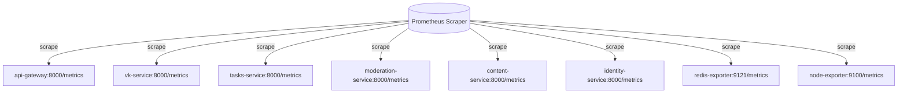

# Архитектурное решение: Разделение и миграция endpoints метрик, здоровья и мониторинга (FASTAPI-MIG-011A)

В рамках перехода с монолитной архитектуры NestJS на микросервисную архитектуру на базе FastAPI (#155) необходимо разделить инфраструктурные и продуктовые endpoints, устранить монолитные зависимости и зафиксировать целевое состояние для следующих категорий:
1. **Инфраструктурные метрики** (Prometheus/Grafana)
2. **Проверки работоспособности** (Liveness/Readiness probes)
3. **Продуктовый API мониторинга** (интерфейс для frontend)

---

## 1. Аудит текущих endpoints в NestJS монолите

Ниже представлен аудит всех действующих endpoints в монолите NestJS, их текущая категория, назначение и используемые ресурсы:

| Путь (Endpoint) | Монолитный контроллер | Категория | Описание и назначение | Задействованные таблицы БД (основная / внешняя) |
| :--- | :--- | :--- | :--- | :--- |
| `GET /metrics` | `MetricsController` | Инфраструктурные метрики | Экспорт Prometheus-совместимых метрик (активность задач, лимиты, системные показатели). | Нет (сбор в оперативной памяти через `prom-client`) |
| `GET /health` | `AppController` | Liveness / Health Check | Проверка доступности системы (БД PostgreSQL, Redis, VK API). | Нет (выполняются пинги/запросы в рантайме) |
| `GET /ready` | `AppController` | Readiness Probe | Определение готовности принимать трафик (проверка подключения к PostgreSQL). | Нет |
| `GET /monitoring/messages` | `MonitoringController` | Продуктовый API | Получение списка отфильтрованных по ключевым словам сообщений из внешних чатов. | **Внешняя:** таблица сообщений в `MONITOR_DATABASE_URL` (например, `messages`) |
| `GET /monitoring/groups` | `MonitoringGroupsController` | Продуктовый API | Получение списка отслеживаемых групп/чатов WhatsApp и Telegram. | **Основная:** `MonitoringGroup`<br>**Внешняя:** таблицы сообщений во внешней БД |
| `POST /monitoring/groups` | `MonitoringGroupsController` | Продуктовый API | Добавление новой группы WhatsApp/Telegram для отслеживания. | **Основная:** `MonitoringGroup` |
| `PATCH /monitoring/groups/:id` | `MonitoringGroupsController` | Продуктовый API | Обновление настроек отслеживаемой группы. | **Основная:** `MonitoringGroup` |
| `DELETE /monitoring/groups/:id` | `MonitoringGroupsController` | Продуктовый API | Удаление отслеживаемой группы. | **Основная:** `MonitoringGroup` |

---

## 2. Целевая архитектурная матрица решений (FastAPI)

При миграции на FastAPI монолитные endpoints разделяются по принципу доменной ответственности. Каждому endpoint сопоставляется целевой сервис-владелец и финальный статус:

| NestJS Endpoint | Целевой статус | Целевой сервис в FastAPI | Обоснование и детали реализации |
| :--- | :--- | :--- | :--- |
| `GET /metrics` | **REPLACE** (Замена) | Все микросервисы (децентрализованно) | Монолитная сборка метрик удаляется. Каждая служба собирает и отдает свои локальные метрики на порту `:8000/metrics`. Prometheus скрейпит каждый контейнер отдельно. |
| `GET /health` | **MIGRATE** (Миграция) | Все микросервисы и API Gateway | Каждый сервис реализует локальный быстрый `/health` (возвращает `{"status": "UP"}`), используемый оркестратором для контроля жизни контейнера. |
| `GET /ready` | **MIGRATE** (Миграция) | Все микросервисы и API Gateway | Каждый сервис реализует локальный `/ready`, проверяющий доступность его собственных backing-сервисов (своя БД, Redis, Kafka-брокер). |
| `GET /monitoring/messages` | **MIGRATE** (Миграция) | `moderation-service` (через API Gateway) | Чтение внешних сообщений переносится в `moderation-service`, так как он является доменным владельцем ключевых слов (keywords) и логики фильтрации. API Gateway проксирует запросы. |
| `GET /monitoring/groups` | **MIGRATE** (Миграция) | `moderation-service` (через API Gateway) | `moderation-service` забирает доменную сущность отслеживаемых групп. Таблица `MonitoringGroup` мигрирует в базу данных `moderation-db`. |
| `POST /monitoring/groups` | **MIGRATE** (Миграция) | `moderation-service` (через API Gateway) | CRUD-операции над группами переносятся в `moderation-service`. API Gateway отвечает за роутинг и авторизацию. |
| `PATCH /monitoring/groups/:id` | **MIGRATE** (Миграция) | `moderation-service` (через API Gateway) | CRUD-операции над группами переносятся в `moderation-service`. |
| `DELETE /monitoring/groups/:id`| **MIGRATE** (Миграция) | `moderation-service` (через API Gateway) | CRUD-операции над группами переносятся in `moderation-service`. |

---

## 3. Детали технической реализации

### 3.1. Архитектура сбора метрик (Decentralized Metrics)

Вместо единого монолитного скрейпинга мы переходим на децентрализованный сбор метрик Prometheus:



1. **Инструментирование FastAPI:**
   В каждом микросервисе для автоматического сбора HTTP-метрик (длительность запросов, коды ответов) подключается пакет `prometheus-fastapi-instrumentator`:
   ```python
   from prometheus_fastapi_instrumentator import Instrumentator

   @app.on_event("startup")
   async def startup_event():
       Instrumentator().instrument(app).expose(app, endpoint="/metrics")
   ```
2. **Распределение кастомных бизнес-метрик по сервисам-владельцам:**
   - **`tasks-service`** экспортирует:
     - `tasks_total` (Counter) — общее число запущенных задач (статусы: `pending`, `running`, `done`, `failed`).
     - `tasks_active` (Gauge) — количество одновременно выполняющихся задач.
   - **`moderation-service`** экспортирует:
     - `watchlist_authors_active` (Gauge) — число авторов на карандаше.
   - **`vk-service`** экспортирует:
     - `vk_api_requests_total` (Counter) — статистика запросов к VK API.
     - `vk_api_request_duration_seconds` (Histogram) — задержка запросов к VK.
     - `vk_api_timeouts_total` / `vk_api_retries_total` (Counter) — сбои сетевого взаимодействия.
3. **Вынос инфраструктуры кэша (Redis Metrics):**
   Метрики Redis (`redis_keys_total`, `redis_memory_bytes`, `redis_keyspace_hit_rate`) полностью удаляются из кода приложений. Для их мониторинга в `docker-compose.yml` развертывается стандартный контейнер-экспортер `oliver006/redis_exporter`, который опрашивает Redis и предоставляет метрики напрямую в Prometheus:
   ```yaml
   redis-exporter:
     image: oliver006/redis_exporter:v1.63.0
     environment:
       - REDIS_ADDR=redis:6379
       - REDIS_PASSWORD=${REDIS_PASSWORD}
     networks:
       - backend
       - monitoring
   ```

### 3.2. Настройка Prometheus (`prometheus.yml`)

Файл `monitoring/prometheus.yml` расширяется для поддержки сбора метрик с новых микросервисов:

```yaml
scrape_configs:
  - job_name: "api-gateway"
    static_configs:
      - targets: ["api-gateway:8000"]
    metrics_path: "/metrics"

  - job_name: "tasks-service"
    static_configs:
      - targets: ["tasks-service:8000"]

  - job_name: "vk-service"
    static_configs:
      - targets: ["vk-service:8000"]

  - job_name: "moderation-service"
    static_configs:
      - targets: ["moderation-service:8000"]

  - job_name: "redis"
    static_configs:
      - targets: ["redis-exporter:9121"]
```

### 3.3. Разделение проверок здоровья (Liveness & Readiness Probes)

В микросервисной архитектуре проверки Liveness (жив ли контейнер) и Readiness (готов ли обрабатывать трафик) должны быть изолированными и легковесными:

1. **Liveness Probe (`/health`):**
   - Назначение: Быстрая проверка рантайма процесса (что Python-интерпретатор не завис).
   - Реализация: Маршрут `/health` во всех микросервисах возвращает моментальный статический ответ `{"status": "UP"}` с кодом `200 OK`.
   - Зависимости: **Отсутствуют**. Нельзя делать тяжелые запросы в БД или сеть, чтобы избежать каскадных перезапусков контейнеров при временном сбое базы данных.
2. **Readiness Probe (`/ready`):**
   - Назначение: Проверка готовности к работе с внешними ресурсами (БД, брокер сообщений).
   - Реализация: Каждый сервис опрашивает свои непосредственные зависимости.
     - `tasks-service` делает быстрый запрос в `tasks-db` (`SELECT 1`) и проверяет пинг Redis/Kafka.
     - `vk-service` проверяет подключение к `vk-db` и доступность Kafka.
     - `api-gateway` проверяет доступность downstream микросервисов через их `/health` эндпоинты.
   - Зависимости: **Локальные ресурсы сервиса**.

### 3.4. Продуктовый API Мониторинга (`/monitoring/*`)

Поскольку функционал `/monitoring` (отслеживаемые группы чатов и фильтрация входящих сообщений) тесно связан с ключевыми словами и правилами фильтрации, вся доменная логика этого модуля закрепляется за **`moderation-service`**:

1. **Миграция Базы Данных:**
   Таблица `MonitoringGroup` переносится из монолитной схемы в PostgreSQL базу данных `moderation-db` с помощью новой миграции Alembic в `services/moderation-service/alembic/versions`.
2. **Синхронизация с Внешней БД (`MONITOR_DATABASE_URL`):**
   В `moderation-service` реализуется фоновый асинхронный шедулер (замена NestJS шедулеру), который считывает новые группы и сообщения из внешней базы `MONITOR_DATABASE_URL` и обновляет внутреннее состояние отслеживаемых сущностей.
3. **Роутинг через API Gateway:**
   API Gateway (`api-gateway`) предоставляет внешние унифицированные endpoints для фронтенда и транслирует их по внутреннему протоколу HTTP (с проверкой JWT авторизации пользователя) в `moderation-service`:
   - `GET /api/monitoring/messages` -> `http://moderation-service:8000/modules/monitoring/messages`
   - `GET/POST/PATCH/DELETE /api/monitoring/groups` -> `http://moderation-service:8000/modules/monitoring/groups`

---

## 4. Исключение NestJS-специфичных зависимостей из рантайм-контракта

В старой NestJS архитектуре присутствовали некоторые неявные решения, от которых необходимо полностью отказаться в новой FastAPI архитектуре:

1. **Интерцептор подавления успешных логов (`LoggingInterceptor`):**
   - *NestJS:* Успешные запросы к `/health` и `/metrics` отфильтровывались в коде интерцептора, чтобы избежать переполнения лог-файлов.
   - *FastAPI:* Подавление логов скрейпинга Prometheus и запросов проверки здоровья настраивается на уровне конфигурации Uvicorn-логгера (`uvicorn.access` log filter) или с помощью специализированного FastAPI Middleware. Это освобождает бизнес-код от низкоуровневых манипуляций логированием.
2. **Ограничение доступа к `/metrics` (`MetricsSecurityMiddleware`):**
   - *NestJS:* Маршрут защищался кастомным middleware, который проверял IP-адрес запроса или API-ключ.
   - *FastAPI / Сетевой уровень:* В микросервисном окружении Docker/Kubernetes порты `:8000/metrics` вообще не пробрасываются наружу во внешний мир (в секции `ports` файла `docker-compose.yml`). Доступ к ним имеет исключительно внутренняя виртуальная сеть Docker (`networks: [backend, monitoring]`), в которой находится Prometheus. Это обеспечивает абсолютную безопасность метрик на уровне сетевой изоляции без необходимости усложнять код авторизацией.
